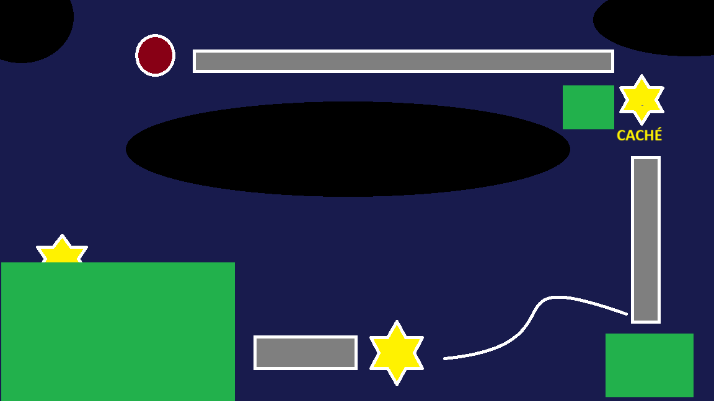
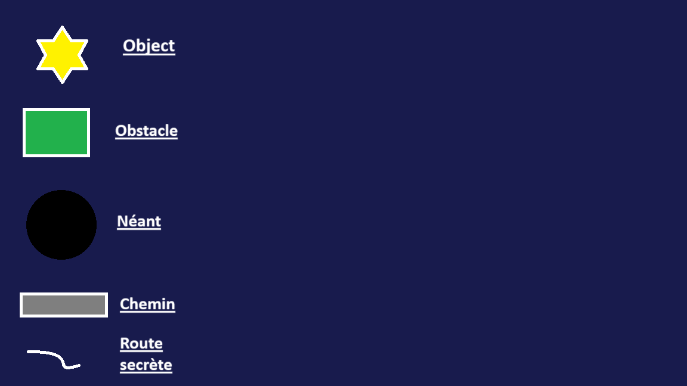

# VR Game plan

## Table des matières
- [Résumé](#Résumé)
- [Description](#Description-écrite-de-la-proposition)
- [Moodboard visuel](#Moodboard-visuel)
- [Moodboard sonore](#Moodboard-sonore)
- [Carte](#Carte-de-votre-environnement-virtuel)
- [Schéma](#Schéma-de-programmation-et-interactivité)
- [Équipe](#Équipe)
- ## Résumé
 "Limitless" est un jeu VR qui s'inspire de l'abstrait. 
## Description écrite de la proposition 
C'est un jeu de réalité virtuelle immersif qui permet aux joueurs d'entrer dans un monde infini abstrait. Le décor donnera un aspect très spatial et mystérieux. L'objectif du joueur est de collecter des objets abstraits à travers l'espace sombre et mystérieux.
## Moodboard visuel 

## Moodboard sonore
[space](https://www.youtube.com/watch?v=kXUnJ61KxRE)
[jupiter](https://www.youtube.com/watch?v=UChzxK9gknM)
## Carte de votre environnement virtuel 

## Schéma de programmation et interactivité

## Équipe
- [Daniel Dezemma] - Programmation
- [Trsitan Kadkha] - Modelisation 3D
- [Alexis Tremblay] - Animation 3D
